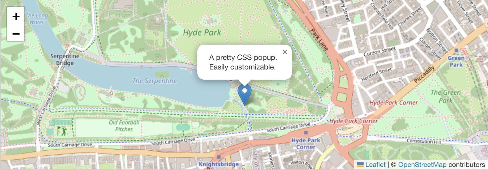

# Maps Toolkit Liferay Fragment Set

Maps Toolkit is a collection of Liferay Fragments that provide easy integration with popular map providers: **Mapbox**, **Google Maps**, **Leaflet**, and a **Preview Locations** fragment. This toolkit is designed for Liferay Developers.

## Fragments Overview

- **Google Maps**: Embed Google Maps with basic controls and marker options.
- **Leaflet**: Use the open-source Leaflet library for lightweight, customizable maps.
- **Mapbox**: Integrate Mapbox maps with customizable styles and settings.
- **City Places Preview**: Preview locations or places (configuration not required).

---

## Mapbox Fragment

**Description:**
Integrates Mapbox maps into your Liferay pages. Requires a Mapbox Access Token and supports multiple map styles.

**Configuration Fields:**
- **Mapbox Access Token** (`accessToken`, text): Your Mapbox API access token.
- **Map Style** (`mapStyle`, select): Choose from various Mapbox styles:
  - Streets 1 (`streets-v12`)
  - Outdoors (`outdoors-v12`)
  - Light (`light-v11`)
  - Dark (`dark-v11`)
  - Satellite (`satellite-v9`)
  - Satellite Streets (`satellite-streets-v12`)
  - Navigation Day (`navigation-day-v1`)
  - Navigation Night (`navigation-night-v1`)
- **Latitude** (`latitude`, text): Initial latitude for map center (default: `-8.0636362`).
- **Longitude** (`longitude`, text): Initial longitude for map center (default: `-34.8727905`).
- **Zoom Level** (`zoom`, text): Initial zoom level (default: `13`).
- **Show Marker** (`showMarker`, checkbox): Display a marker at the center (default: `true`).
- **Show User Location** (`showUserLocation`, checkbox): Show the user's current location (default: `false`).

---

## Google Maps

**Description:**
Embeds a Google Map with configurable center, zoom, and marker/user location display.

**Configuration Fields:**
- **Google Maps Access Token** (`accessToken`, text): Your Google Maps API access token.
- **Latitude** (`latitude`, text): Initial latitude for map center (default: `-8.0636362`).
- **Longitude** (`longitude`, text): Initial longitude for map center (default: `-34.8727905`).
- **Zoom Level** (`zoom`, text): Initial zoom level (default: `13`).
- **Show Marker** (`showMarker`, checkbox): Display a marker at the center (default: `true`).
- **Show User Location** (`showUserLocation`, checkbox): Show the user's current location (default: `false`).
- **Google Maps Script URL** (`googleMapsScriptURL`, text): URL for loading the Google Maps script (default: `https://maps.googleapis.com/maps/api/js`).

---

## Leaflet

**Description:**
Integrates the Leaflet open-source map library for simple, customizable maps.

**Configuration Fields:**
- **Latitude** (`latitude`, text): Initial latitude for map center (default: `-8.0636362`).
- **Longitude** (`longitude`, text): Initial longitude for map center (default: `-34.8727905`).
- **Zoom Level** (`zoom`, text): Initial zoom level (default: `13`).
- **Show Marker** (`showMarker`, checkbox): Display a marker at the center (default: `true`).
- **Show User Location** (`showUserLocation`, checkbox): Show the user's current location (default: `false`).

---

## Here Maps

**Description:**
Integrates HERE Maps into your Liferay pages. Requires a HERE Maps API Key and supports multiple map styles and dynamic markers.

**Configuration Fields:**
- **Here Maps API Key** (`apiKey`, text): Your HERE Maps API key.
- **Latitude** (`latitude`, text): Initial latitude for map center (default: `-8.0636362`).
- **Longitude** (`longitude`, text): Initial longitude for map center (default: `-34.8727905`).
- **Zoom Level** (`zoom`, text): Initial zoom level (default: `13`).
- **Show Marker** (`showMarker`, checkbox): Display a marker at the center (default: `true`).
- **Show User Location** (`showUserLocation`, checkbox): Show the user's current location (default: `false`).
- **Map Style** (`mapStyle`, select): Choose from various HERE Maps styles:
  - Normal (`normal`)
  - Satellite (`satellite`)
  - Standard (`standard`)
  - Terrain (`terrain`)
- **Custom Marker Icon URL** (`defaultMarkerIconURL`, text): URL for custom marker icon (default: `https://cdn.jsdelivr.net/npm/heroicons@2.0.18/24/solid/map-pin.svg`).
- **Dynamic Markers** (`markersJSON`, text): JSON array of markers to display on the map (default: `[]`).

---

## City Places Preview

**Description:**
Preview locations or places. This fragment does not require configuration.

---

## Usage Notes

- For Mapbox and Google Maps, you must provide your own API access tokens.
- All map fragments support initial center and zoom configuration.
- Marker and user location display are optional and can be toggled via configuration.
- For advanced customization, refer to each fragment's configuration.json for all available options.

1. Deploy the fragment set to your Liferay instance.
2. Add the desired map fragment to your page.
3. Configure the fragment using the sidebar panel, filling in the required fields as described above.

## Requirements
- Liferay DXP/Portal 7.4+
- For Mapbox: A valid Mapbox Access Token
- For Google Maps: A valid google Maps Access Token

## Contributing

We welcome contributions to the Maps Toolkit! Here's how you can help:

1. **Report Bugs**: If you find a bug, please open an issue with:
   - A clear description of the problem
   - Steps to reproduce the issue
   - Expected vs actual behavior
   - Screenshots if applicable

2. **Suggest Features**: Have an idea for a new feature or improvement?
   - Open an issue with a detailed description
   - Explain why this feature would be useful
   - Include any relevant examples or use cases

3. **Submit Pull Requests**:
   - Fork the repository
   - Create a new branch for your feature/fix
   - Ensure your code follows the existing style
   - Add tests if applicable
   - Update documentation as needed
   - Submit a pull request with a clear description of changes

## License
MIT
